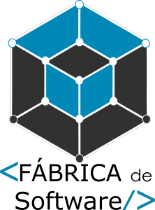

# 
Práticas em Desenvolvimento de Software (KickStart)

  

Este repositório tem como objetivo reunir modelos de documentos e artefatos que podem ser produzidos durante o processo de desenvolvimento do projeto no escopo da disciplinas de Prática em Desenvolvimento de Software I e II da Faculdade de Computação (FACOM) da Universidade Federal do Mato Grosso do Sul (UFMS).

Lembre-se que os arquivos aqui disponíveis tem o propósito de prover uma visão prática aos alunos para a criação de seus próprios artefatos. Assim, cada documento deve ser analisado de forma crítica e seu conteúdo adaptado. Além disso, se você é membro de uma equipe e deseja usar um (ou mais) arquivos, lembre-se de conversar com seu professor orientador primeiro.

Os artefatos estão separados pelos seguintes tópicos:

- [Projeto](projeto)
- [Ambiente](ambiente)
- [Arquitetura](arquitetura)
- [Evolução de Projeto de Software](evolucao)
- [Requisitos](requisitos)
- [Implantação](implantacao)
- [Verificação, Validação e Testes](vvt)
- [Atas de Reuniões](atas)
