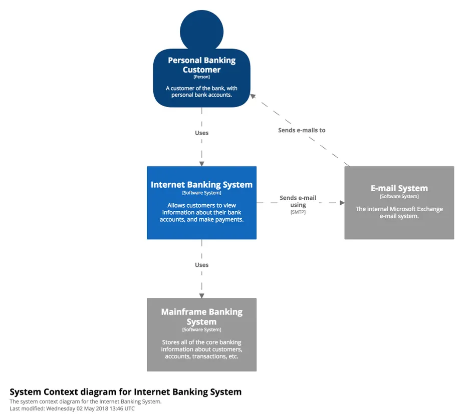
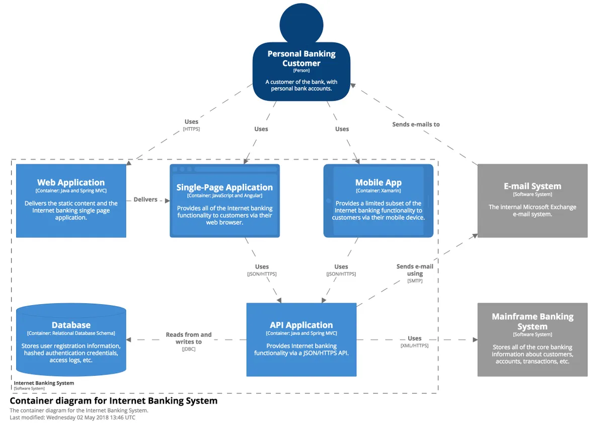

## Especificação de Arquitetura de Software

### 1. Introdução

Este documento tem como objetivo descrever a arquitetura do Sistema `<Nome do Sistema>`, seguindo o modelo de visualização arquitetural de software C4[^1].

[^1]: Referência: BROWN, Simon. The C4 model for visualising software architecture – Context, Containers, Components, and Code. Disponível em https://c4model.com/

`<Inclua um parágrafo com a justificativa da sua equipe para escolher o modelo C4 para representação das visões arquiteturais.>`

### 2. Escopo

Este documento auxilia os envolvidos no projeto a compreender os aspectos arquiteturais do sistema que são necessários para desenvolver uma solução que atenda as necessidades do proponente. Além de auxiliar equipes futuras no entendimento do projeto.

#### 2.1. Restrições do sistema

`<Incluir uma listagem de restrições e decisões do sistema e suas justificativas.>`

> Exemplo:
>
> Framework CakePHP: A escolha do CakePHP foi feita, devido a restrições do servidor de produção e visando facilidade de manutenção do sistema, uma vez que o ambiente de produção já possui outros sistemas desenvolvidos com o framework CakePHP.
>
> Padrão arquitetural: O padrão MVC (Model-View-Controller) é uma decisão arquitetural desencadeada pela escolha da utilização do framework CakePHP.

### 3. Representação arquitetural

O modelo C4 considera as estruturas estáticas de um sistema de software em termos de containers (aplicativos, armazenamentos de dados, microservices, etc.), componentes e código. Também considera as pessoas que usam os sistemas de software que construímos.

#### 3.1. Nível 1 – Diagrama de Contexto

`<O diagrama de contexto do sistema, mostra o sistema de software que você está construindo e como ele se encaixa no mundo em termos das pessoas que o utilizam e dos outros sistemas de software com os quais ele interage. Esse diagrama é obrigatório.>`

> Exemplo:
> 
> Inclua o link para o arquivo de em alta resolução e/ou para o diagrama disponível online na ferramenta case.
>
> Sugestão de ferramentas com notação C4: Diagrams.net (https://www.diagrams.net/): no menu View - Shapes, escolha o C4 na lista de shapes habilitados. Visual Paradigm Online: instruções disponíveis em https://online.visual-paradigm.com/pt/diagrams/features/c4-model-tool/
>
> Lucidchart: instruções disponíveis em https://www.lucidchart.com/pages/templates/visualize-technical-systems/lucidchart-c-4-model-example

#### 3.2. Nível 2 – Diagrama de Container

`<O diagrama de container, amplia o sistema de software e mostra os containers (aplicativos, armazenamentos de dados, microservices, etc.) que compõem esse sistema de software. As decisões de tecnologia também são uma parte fundamental desse diagrama. Esse diagrama é obrigatório.>`

> Exemplo
> 
> Inclua o link para o arquivo de em alta resolução e/ou para o diagrama disponível online na ferramenta case.

#### 3.3. Nível 3 – Diagrama de Componentes

`<Um diagrama de componentes, amplia um container individual para mostrar os componentes dentro dele. Esses componentes devem mapear para abstrações reais (por exemplo, um agrupamento de código) em sua base de código.>`

> Esse nível é opcional.

> Pode ser criado um diagrama de componentes para cada container que se fizer necessário. É altamente recomendável a elaboração do diagrama de componentes para os containers mais complexos, como por exemplo, a aplicação de provedora dos serviços (backend).

> Incluir figura de diagrama de componentes, seguido de uma breve explicação do mesmo.

#### 3.4. Nível 4 – Código

`<Não é necessário, e nem recomendável, representar o nível de código para todos os componentes do sistema. Escolha apenas os componentes mais importantes, se houver.>`

> São recomendações de diagramas para esse nível:
>
> - Diagrama de classes de projeto: contém todas as classes implementadas do sistema. Não é obrigatório a representação de métodos, mas é recomendável a representação dos atributos;
> - Diagrama de classes de entidade: uma parte do diagrama de classes de projeto que contém apenas as classes persistentes;
> - Diagrama de entidade-relacionamento: representa o banco de dados.

> Todos os diagramas desse nível são opcionais. Entretanto é altamente recomendado representar no mínimo o diagrama de classes de entidade ou DER.

> Fique atento para otimizar a visualização evitando espaços em branco desnecessários. Prefira layout vertical para o diagrama se encaixar na página do documento.

#### 3.5. Diagramas suplementares – Diagrama de Implantação

`<Um diagrama de implantação permite ilustrar como os sistemas de software e / ou contêineres no modelo estático são mapeados para a infraestrutura de hardware e rede.>`

> O diagrama de implantação não é necessário quando o sistema em desenvolvimento é monolítico. Porém é obrigatório nos demais casos.

> Este diagrama de implantação deve ser feito utilizando o diagrama de implantação da UML. Um nó de implantação é algo como infraestrutura física (por exemplo, um servidor ou dispositivo físico), infraestrutura virtualizada (por exemplo, IaaS, PaaS, máquina virtual), infraestrutura em container (por exemplo, um container Docker), um ambiente de execução (por exemplo, servidor de banco de dados, Java EE servidor web / de aplicativos), etc. Os nós de implantação podem ser aninhados.

> Incluir figura do diagrama de implantação.
