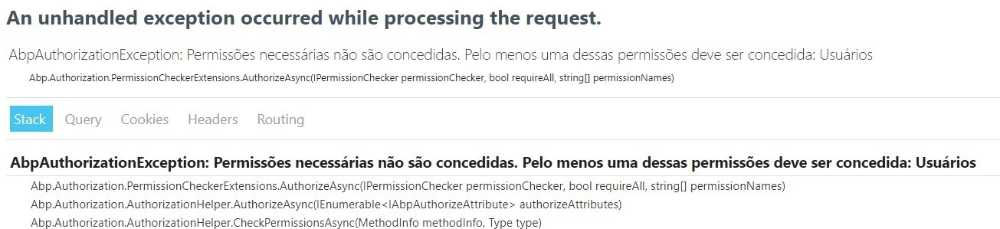
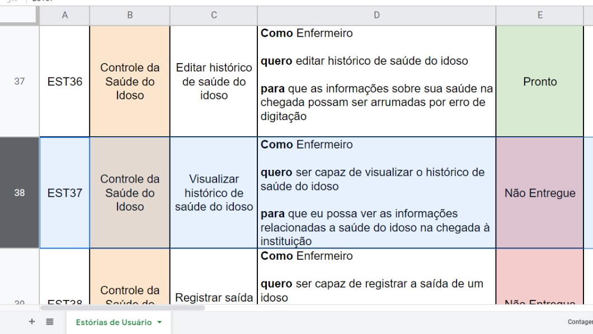
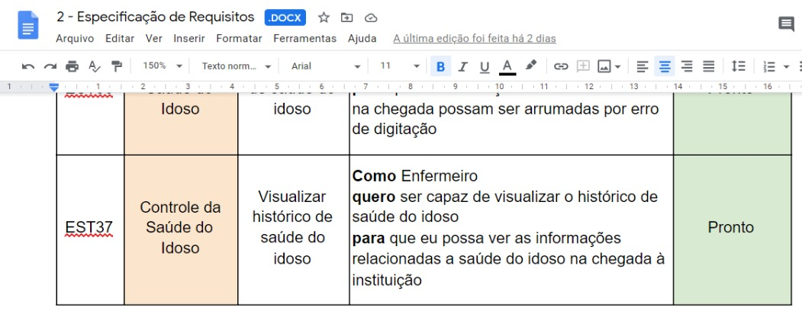

## Análise Preliminar de Projeto

### 1. Introdução

Este documento tem como objetivo registrar a análise geral do sistema `<nome do sistema>` desenvolvido no Núcleo de Práticas em Engenharia de Software `<semestre>` semestre do ano de `<ano>` para `<identificação do cliente>`. Essa análise foi realizada em todos os artefatos produzidos pela equipe anterior: protótipos, artefatos textuais e diagramas, código-fonte e aplicativo executável.

O resultado apresentado neste documento traz as inconsistências encontradas e possíveis soluções para a correção das mesmas.

Além disso, foi realizada uma discussão acerca da linguagem de desenvolvimento escolhida para o desenvolvimento, suas vantagens, desvantagens e impactos para o andamento do projeto e para o futuro sistema. Para tal foi considerada não somente a etapa de desenvolvimento, mas também o sistema em produção (sistema implantado e configurado no servidor do cliente e em uso).

### 2. Tecnologias aplicadas para o desenvolvimento

`<Incluir as definições de tecnologias, linguagens e ferramentas utilizadas para o desenvolvimento do sistema.>`

> Exemplo:
>
> O framework escolhido pela equipe anterior foi o .NET, para o desenvolvimento do backend, o .NET utiliza a linguagem C#.

### 3. Inconsistências entre Escopo do Projeto e o que foi desenvolvido

Esse tópico foi dividido em módulos, onde cada módulo representa uma subárea do sistema, e dentro de cada subárea foram definidas as funcionalidades e defeitos, se encontrados.

> Exemplo
>
> #### 3.1 Módulo 1 - Usuários
>
> Funcionalidade 1.1 - Gerenciamento de Função
>
> 1.1.1. `<Exemplo de defeito encontrado: Usuário com a função “Históricos” adicionado a ele, não consegue adicionar uma evolução dentro do histórico, ele consegue visualizar, editar e remover, mas não adicionar.>`
>
> 
>
> Para cada defeito encontrado, tente incluir uma imagem.>

### 4. Inconsistência entre Especificação de Requisitos e Backlog do Produto

`<Elimine essa seção se não houver esse tipo de inconsistência, inclua outras seções conforme necessário.>`

> Exemplo:
>
> No backlog do produto, o requisito com o identificador EST37 - “Visualizar histórico de saúde do idoso” está como não entregue, enquanto na especificação de requisitos ele está declarado como entregue.
>
> 
>
> 

### 5. Inconsistências entre mockups e telas desenvolvidas

`<Elimine essa seção se não houver esse tipo de inconsistência, inclua outras seções conforme necessário.>`

> Exemplo:
>
> Mockups desenvolvidos e validados com a cliente não eram seguidos como exemplo para o desenvolvimento, assim, o que foi prototipado é muito diferente do que foi desenvolvido. As telas que a cliente aprovou não foram desenvolvidas.

> Inclua imagens para comprovar a inconsistência.
