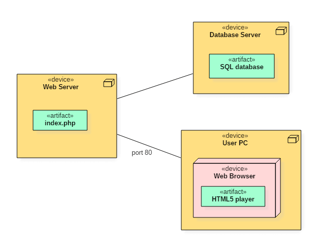
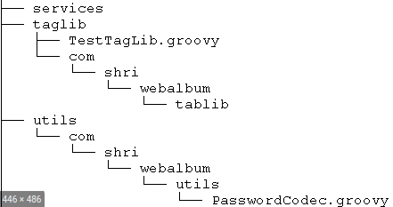

##### Faculdade de Computação   Núcleo de Práticas em Engenharia de Software

### Documento de Implantação   `<nome do projeto>`   Versão `<versão>`

#### Histórico de Alterações do Documento

| Data | Versão | Descrição | Autor |
| ---- | ------ | --------- | ----- |
|      |        |           |       |

### 1. Diagrama de Implantação

Nesta seção será apresentado o diagrama de implantação dos subsistemas que compõem o projeto.

`<Inclua o diagrama de implantação do projeto e descreva brevemente o mesmo>`

### 2. Estrutura do código fonte

Nesta seção serão apresentadas a estrutura de pastas e arquivos de todos os subsistemas que compõem o diagrama de implantação.

`<Devem ser adicionados todos os subsistemas previstos no Diagrama de Implantação. Neste modelo utilizamos, por exemplo, subsistema 1 e subsistema 2>`

#### 2.1. Estrutura do Subsistema 1

Nesta subseção será apresentada a estrutura de pastas e arquivos do subsistema 1 presente no diagrama de implantação.

`<Utilize uma ferramenta para criação de um diagrama de árvore de diretórios e forneça uma descrição>`

#### 2.2. Estrutura do Subsistema 2

Nesta subseção será apresentada a estrutura de pastas e arquivos do subsistema 2 presente no diagrama de implantação.

`<Utilize uma ferramenta para criação de um diagrama de árvore de diretórios e forneça uma descrição>`

### 3. Instalação e Execução

Nesta seção serão apresentados os procedimentos necessários para a instalação e execução do projeto.

#### 3.1. Subsistema 1

`<Descrever os procedimentos para instalação e execução do subsistema 1>`

##### 3.1.1. Ambiente de Desenvolvimento

`<Descrever os procedimentos para instalação e configuração do ambiente de desenvolvimento do subsistema 1>`

##### 3.1.2. Ambiente de Produção

`<Descrever os procedimentos para instalação e configuração do ambiente de produção do subsistema 1>`

#### 3.2. Subsistema 2

`<Descrever os procedimentos para instalação e execução do subsistema 2>`

##### 3.2.1. Ambiente de Desenvolvimento

`<Descrever os procedimentos para instalação e configuração do ambiente de desenvolvimento do subsistema 2>`

###### Variáveis de ambiente

| Variável          | Valor        |
| ----------------- | ------------ |
| DATABASE_URL      | localhost    |
| DATABASE_USER     | dbuser       |
| DATABASE_PASSWORD | weakpassword |

##### 3.2.2. Ambiente de Produção

`<Descrever os procedimentos para instalação e configuração do ambiente de produção do subsistema 2>`

###### Variáveis de ambiente

| Variável          | Valor        |
| ----------------- | ------------ |
| DATABASE_URL      | localhost    |
| DATABASE_USER     | dbuser       |
| DATABASE_PASSWORD | weakpassword |

### 4. Problemas Conhecidos

`<Descrever nesta seção os problemas/erros conhecidos relacionados ao código, ambiente de execução e dependências>`
